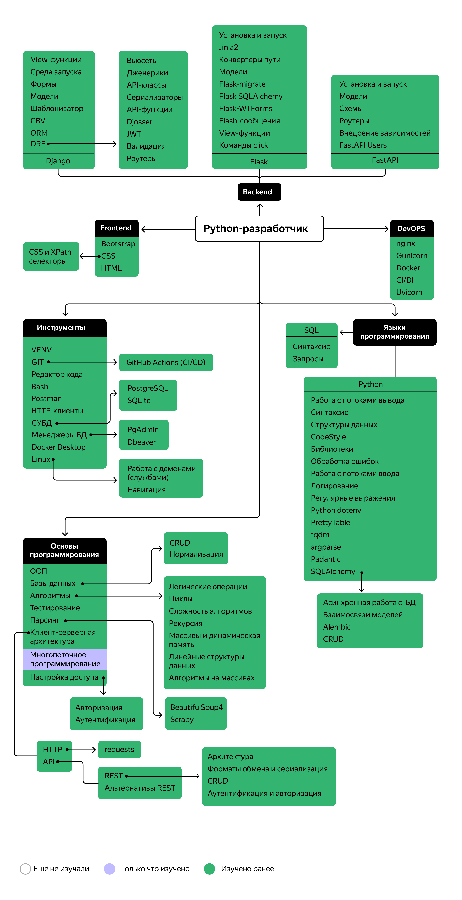

## Откуда коды растут:

Когда мне было 12 лет моя мама училась заочно в техникуме и читала мне свои конспекты по информатике.

Я довольно быстро разобрался с системами счисления и таблицами истинности. Однажды мама взяла меня с собой на контрольную и я решил все варианты заданий почти для всей группы. Через несколько лет я сам уже учился в этом техникуме.

В то время у меня был ZX-Spectrum, и я писал что-то из журналов на бейсике (но больше конечно играл в любимую Sim City). Именно в тот период появилась мечта стать программистом.

Но… стал я геодезистом. Семнадцать лет после института проработал инженером-геодезистом.

В процессе работы всегда понимал, что автоматизировать рутинную работу мне нравится больше, чем эту работу делать вручную.

Поэтому я решился вернуться к мечте и всё изменить. Я поступил на курс "Python разрабтчик плюс" от Яндекс практикума. И вот спринт за спринтом я постигаю что такое бэкенд разработка и очень этому рад!

## Моя карта навыков:

## Мой стек технологий:

&nbsp;&nbsp;&nbsp;&nbsp;&nbsp;&nbsp;&nbsp;&nbsp;&nbsp;&nbsp;&nbsp;&nbsp;&nbsp;&nbsp;
&nbsp;

